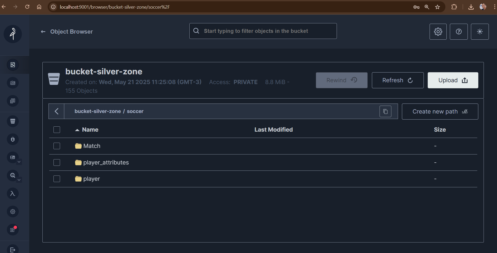

# 📘 Projeto Final — Módulo: Arquiteturas de ETL e ELT (MBA) 
# Entrega até 23/05/2025

---
## 🎯 Objetivo

Desenvolver uma **pipeline completa de dados** baseada na **Medallion Architecture** (camadas Bronze, Silver e Gold), utilizando tecnologias modernas de processamento e orquestração de dados. O projeto será baseado em dados reais do futebol europeu, que estão disponíveis no seguinte bucket:

```
s3://dev-lab-02-us-east-2-landing/soccer/
```

---
## 🛠️ Tecnologias Utilizadas

🗄️ Armazenamento: MinIO (via Docker)

⚡ Processamento: Apache Spark local via Jupyter

🗂️ Formato de Dados: Delta Lake

🔍 Consulta: Spark SQL

🧩 Orquestração: Scripts manuais e Jupyter Notebooks

📝 Versionamento: Git


---

## 🧱 Arquitetura do Projeto

## 🥉 Bronze

📥 Ingestão bruta dos dados do bucket S3.

💾 Armazenamento como Delta Table no MinIO.

🏷️ Inclusão de colunas de metadados como arquivo de origem e horário de ingestão.

---

##🥈 Silver

🔧 Transformações aplicadas: normalização, limpeza, renomeação de colunas, tratamento de nulos.

🔗 Joins entre tabelas.

💾 Gravação como Delta Tables particionadas por year.

---

##🥇 Gold

📊 Dados prontos para análise.

📈 Datasets analíticos agregados (ex: média de gols por temporada e time).

🔄 Tabelas derivadas da camada Silver.

---

## 📁 Organização do Projeto


project/
│
├── README.md
├── docker-compose.yml                          
├── dicionario_dados/
│   ├── silver.md
│   └── gold.md
│
├── notebooks/                         
│   ├── bronze
│        ├── bronze.ipynb
│   ├── silver
│        ├── player.ipynb
│        ├── player_attributes.ipynb
│        ├── match.ipynb
│        ├── joins.ipynb
│   ├── gold
│        ├── gold.ipynb
│
├── imagens/                         
│   ├── bucket-silver.png
│   ├── saida-gold.png


---

🚀 Como Iniciar o Projeto

1. Clone o repositório ou baixe os arquivos .zip.

2. Suba o ambiente Docker:

```bash
docker-compose up -d
```

Isso irá levantar os serviços:

🗄️ MinIO — disponível em: http://localhost:9001
➡️ Login: admin
➡️ Senha: senhasegura

➡️ Buckets criados:

* bucket-bronze-zone
* bucket-silver-zone
* bucket-gold-zone

⚡ Spark Master — disponível em: http://localhost:8080

⚡ Spark Worker — disponível em: http://localhost:8081

📓 Jupyter Notebook — disponível em: http://localhost:8888

➡️ O token de acesso será exibido nos logs do container jupyter.


3. Execute os notebooks sequencialmente:

Bronze: notebooks/bronze/bronze.ipynb

Silver: notebooks/silver/player.ipynb, player_attributes.ipynb, match.ipynb, joins.ipynb

Gold: notebooks/gold/gold.ipynb


4. Monitore e valide os dados:

Acesse o console do MinIO para verificar as tabelas armazenadas como Delta Lake.

Utilize a interface web do Spark para monitorar jobs.

---

## 🖼️ Imagens do Projeto em Execução

📂 Bucket Silver no MinIO



📊 Saída do Código Jupyter - Gold Layer


---

## 📊 Estatísticas Calculadas

### 🏅 Top 10 Jogadores com Maior `overall_rating` e `potential`

| player_api_id | overall_rating | potential |
|---------------|----------------|-----------|
| 30981         | 94             | 97        |
| 30717         | 93             | 93        |
| 30829         | 93             | 93        |
| 30893         | 93             | 93        |
| 39989         | 92             | 93        |
| 39854         | 92             | 92        |
| 30743         | 91             | 95        |
| 30626         | 91             | 93        |
| 30955         | 91             | 93        |
| 30657         | 91             | 92        |

---

### 🏋️‍♂️ Médias dos Atributos Técnicos e Físicos

| Atributo          | Média |
|-------------------|-------|
| Curve             | 53.00 |
| Vision            | 57.87 |
| Agility           | 65.99 |
| Balance           | 65.19 |
| Jumping           | 66.98 |
| Marking           | 46.76 |
| Stamina           | 67.05 |
| Volleys           | 49.49 |
| Crossing          | 55.14 |
| Strength          | 67.43 |
| Dribbling         | 59.27 |
| Finishing         | 49.96 |
| Long Shots        | 53.39 |
| Shot Power        | 61.87 |
| Positioning       | 55.73 |
| Acceleration      | 67.71 |
| Ball Control      | 63.45 |
| Long Passing      | 57.08 |
| Sprint Speed      | 68.10 |
| Interceptions     | 51.90 |
| Short Passing     | 62.49 |

---

### ⚽ Total de Partidas por Temporada

| Season   | Total Matches |
|---------- |--------------|
| 2012/2013 | 1762        |

---

### 📏 Desvio Padrão de Gols por Temporada

| Season   | Std Dev Home Goals | Std Dev Away Goals |
|---------- |-------------------|--------------------|
| 2012/2013 | 1.31              | 1.14               |

---

### 🔝 Máximo e Mínimo de Gols por Temporada

| Season   | Max Home Goals | Min Home Goals | Max Away Goals | Min Away Goals |
|---------- |--------------- |--------------- |--------------- |--------------- |
| 2012/2013 | 9             | 0              | 6             | 0              |

---

### ➖ Diferença Média de Gols por Temporada

| Season   | Avg Goal Difference |
|---------- |--------------------|
| 2012/2013 | 1.33              |

---

### 🏡 Média de Gols por Time (Mandante)

*(Exibindo top 20)*

| Home Team API ID | Avg Home Goals |
|------------------|----------------|
| 8456             | 2.11           |
| 9879             | 1.47           |
| 9825             | 2.47           |
| 10172            | 0.68           |
| 10252            | 1.21           |
| ...              | ...            |

---

### 🛫 Média de Gols por Time (Visitante)

*(Exibindo top 20)*

| Away Team API ID | Avg Away Goals |
|------------------|----------------|
| 8456             | 1.32           |
| 9879             | 1.11           |
| 9825             | 1.32           |
| 10172            | 0.89           |
| 10252            | 1.26           |
| ...              | ...            |


---
# 📝 Créditos
Estudante: [Kleber Barros](https://github.com/kleberbarros9)  
Disciplina: Arquitetura de ETL e Integração de Dados Corporativos
Professor: Esp. [Esp. Thiago Santos](https://github.com/thisthiago)
Especialização: MBA em Business Intelligence & Big Data


---

# 📄 Licença
Este projeto é licenciado sob a MIT License — sinta-se à vontade para copiar, modificar e distribuir.

Veja mais detalhes em: https://opensource.org/licenses/MIT

---